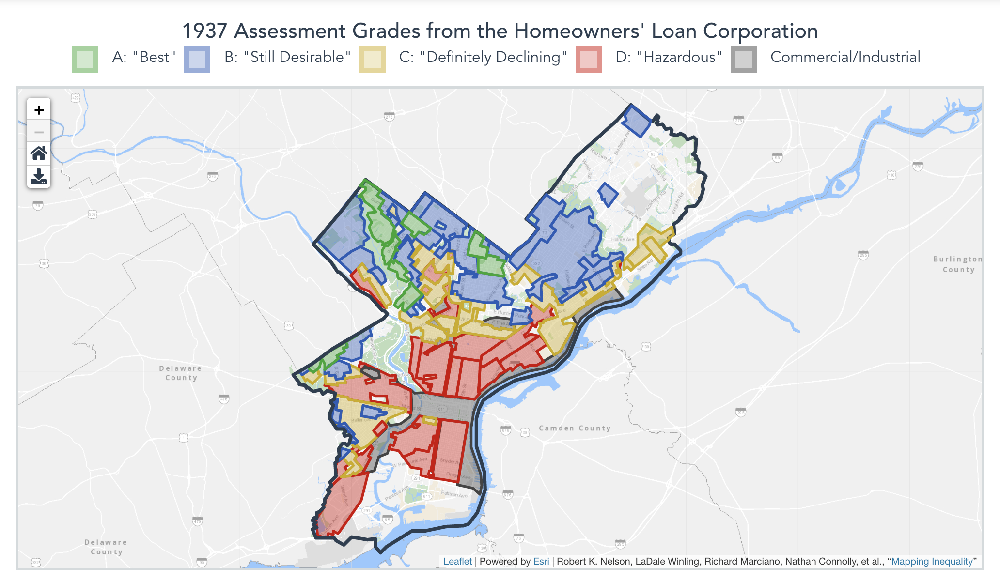
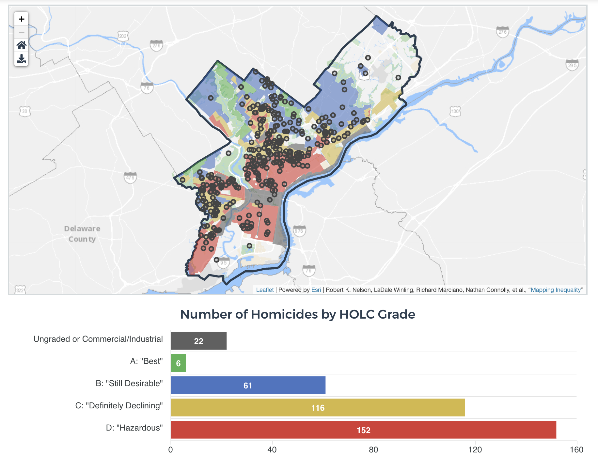
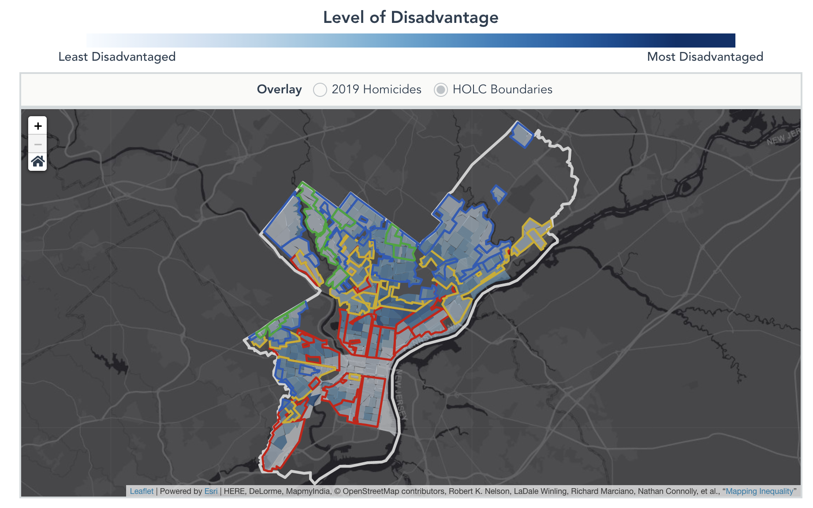

# MappingStructuralRacism

The code behind the interactive report that maps 2019 homicides, present-day disadvantage, and 1930s redlining maps.

The interactive report is available [here](https://controller.phila.gov/philadelphia-audits/mapping-the-legacy-of-structural-racism-in-philadelphia/).





## Tools

Built using vue, [esri-leaflet](https://github.com/Esri/esri-leaflet), and [vue-apexcharts](https://github.com/apexcharts/vue-apexcharts)

## Development

#### Compiles and hot-reloads for development

```
npm run serve
```

#### Compiles and minifies for production

```
npm run build
```
